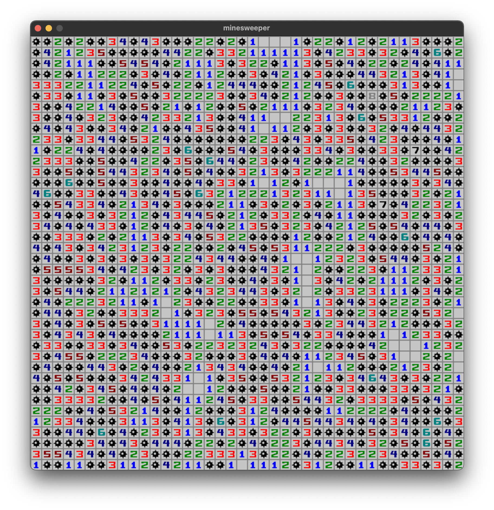

# minesweeper
An implementation of the well known minesweeper game



## How to compile
```sh
make
```

## Usage
```sh
./minesweeper [board_size] [level]
```

`board_size` : A number between 5 and 40 (*default is 16*)  
`level` : Choose between `--easy`, `--medium` and `--hard` (*default is --easy*)  
